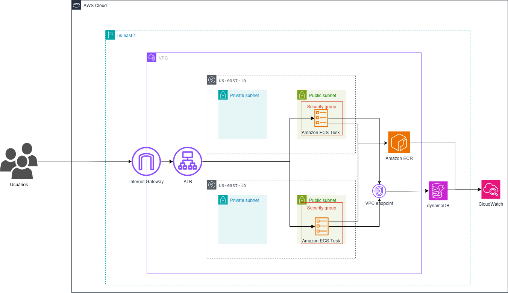

# Arquitetura e Inventário de Recursos

## 1. Topologia da Arquitetura

A arquitetura foi desenhada para garantir alta disponibilidade e isolamento de rede na região `us-east-1`.

## 2. Inventário de Recursos Provisionados

O ambiente implanta os seguintes serviços na AWS:

| Categoria | Serviço AWS | Descrição / Papel no Projeto |
| :--- | :--- | :--- |
| **Rede (Networking)** | Amazon VPC | 1 VPC principal garantindo isolamento lógico do ambiente. |
| **Rede (Networking)** | Amazon Subnets | 2 Sub-redes Públicas e 2 Privadas em múltiplas AZs (`us-east-1a` e `us-east-1b`). |
| **Acesso e Roteamento** | Internet Gateway & NAT | Controle de entrada e saída de tráfego para a internet. |
| **Balanceamento** | Application Load Balancer (ALB) | Distribuição de tráfego HTTP porta 80/3000 para as tasks. |
| **Segurança** | Security Groups | Firewalls locais restringindo tráfego apenas para portas essenciais. |
| **Computação** | Amazon ECS (Fargate) | Cluster Serverless executando as tasks do contêiner Node.js. |
| **Armazenamento (Imagens)** | Amazon ECR | Repositório privado contendo a imagem `payment-app:latest`. |
| **Banco de Dados** | Amazon DynamoDB | Tabela NoSQL (`CyberBank_Users` / `Transactions`) para persistência de estado. |
| **Observabilidade** | Amazon CloudWatch | Grupo de logs recebendo as saídas de eventos sintéticos (stdout). |
