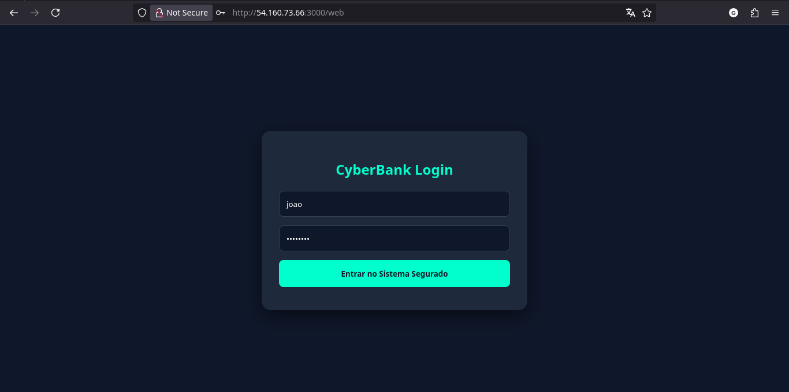
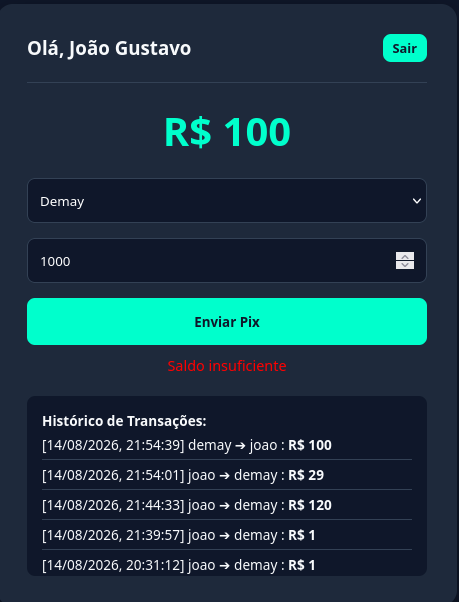
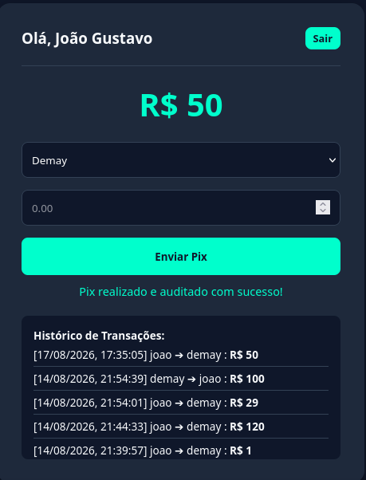
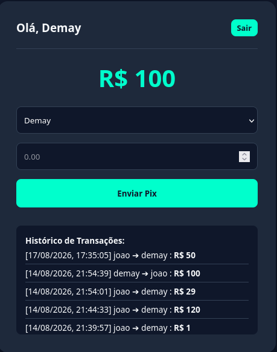
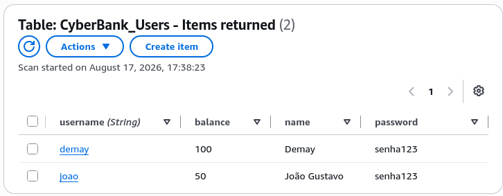
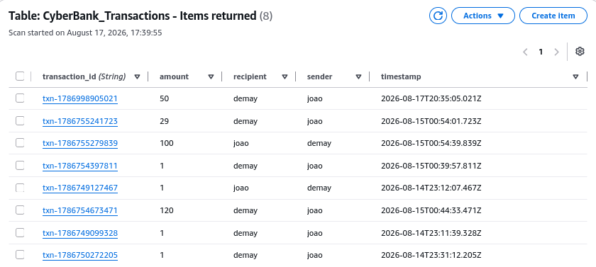

# Evidências Operacionais

Este diretório contém a comprovação visual do funcionamento da arquitetura provisionada, validação das regras de negócio e observabilidade[cite: 1].

### 1. Persistência e Regras de Negócio (DynamoDB)
*A aplicação vai além de um modelo stateless, utilizando o DynamoDB para evitar fraudes e auditar transferências.*

*    - Tela de acesso à aplicação.
*    - Validação em tempo real bloqueando o Pix por saldo insuficiente.
*    - Sucesso na transação com o histórico atualizado na conta de origem.
*    - Confirmação do saldo atualizado na conta de destino.

### 2. Tabelas de Estado (AWS Console)
*    - Tabela armazenando as credenciais e saldos.
*    - Registro ACID das transferências financeiras.

### 3. Contrato da API e Observabilidade
*(Após tirar os prints do terminal e do CloudWatch, salve-os aqui na pasta com nomes como `Terminal_API.png` e `CloudWatch_Logs.png` e adicione os links abaixo)*

*    - Validação dos endpoints GET `/` e POST `/events`.
*    - Eventos sintéticos recebidos e exportados com sucesso para o Amazon CloudWatch[cite: 1].
